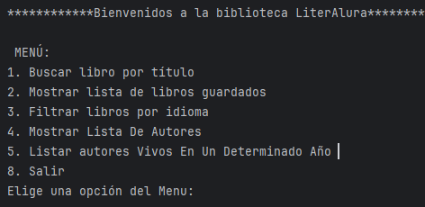
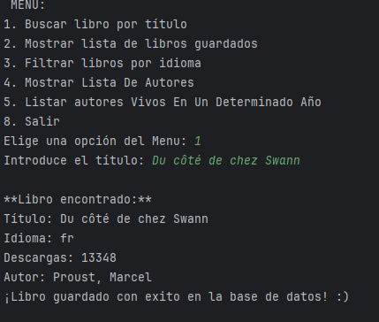
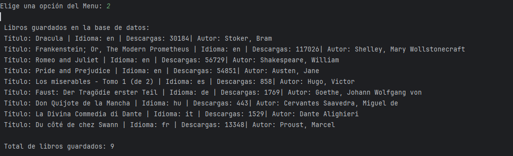
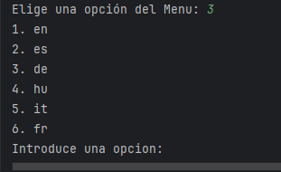
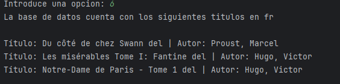
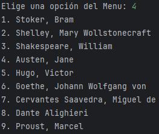
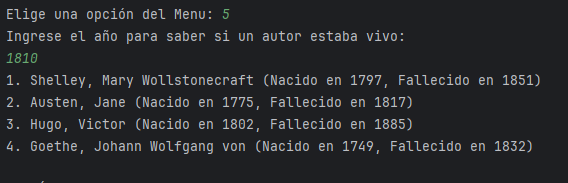
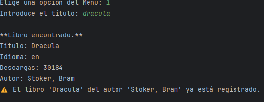

# LITERALURA


#📚 Biblioteca de Libros – Consola Java + Spring Boot

Una aplicación de consola que permite buscar, guardar y filtrar libros obtenidos desde la API de Gutendex. 
El proyecto incluye persistencia en base de datos PostgreSQL, validaciones, relaciones entre entidades y una interfaz dinámica en consola.

##🧪 Tecnologías Utilizadas
Java 17

-Spring Boot

-Spring Data JPA

-PostgreSQL

-Gutendex API

-Maven

-pgAdmin

-Interfaz por consola (Scanner)

### 📋 Menú principal
Muestra las opciones principales que el usuario puede elegir al iniciar el programa.



### Menu opcion 1
Solicita al usuario que ingrese un titulo de libro a buscar.
Luego si lo encuentra devuelve 



### Menu opcion 2

-Trae una lista de los libros guardados en la base de datos,idioma, cantidad descargas y autor.
-Tambien hay un contador para ver cuantos libros hay en la base de datos




### 🌐 Submenú dinámico por idioma
Generado automáticamente a partir de los idiomas disponibles en la base de datos.

Cuando el usuario selecciona la opción 3 del menú, el sistema muestra un listado de idiomas generados dinámicamente a partir de los libros guardados en la base de datos.



### 💡 ¿Cómo funciona?

- Se obtienen todos los libros almacenados (`findAll()`).
- Se agrupan los idiomas con Streams (`distinct()`).
- Se genera un submenú basado en esa lista.
- El usuario elige un idioma por número y se muestran los libros correspondientes.

```java
List<String> listaIdiomas = librosService.obtenerIdiomasDisponibles();
for (int i = 0; i < listaIdiomas.size(); i++) {
    System.out.println((i + 1) + ". " + listaIdiomas.get(i));
}
````
### Ejemplo

Aqui se ingresa la opcion 6 (fr) Frances y devuelve la lista de libros en ese idioma



## ✅ Ventajas del enfoque dinámico
-Escalable: No requiere reescritura al agregar nuevos idiomas.

-Flexible: Siempre se actualiza con base en lo almacenado.

-Mantenible: Evita menús estáticos o validaciones rígidas.

# Opcion 4

### 🧓 Lista de autores
Ejemplo del filtro que muestra una lista de  autores.



# Opcion 5 
se pide al usuario un año para saber cual autor estaba vivo en esa fecha




# 🔄 Validación de Libros Duplicados
Antes de guardar un libro, el sistema valida si ya existe uno con el mismo título y nombre de autor usando un método como:



Si el libro ya está en la base, se evita el guardado y se muestra un mensaje claro en consola.

# 🛠️ Ejecución del Proyecto
1-> Cloná el repositorio

2 ->Configurá la base de datos en application.properties

3->
Ejecutá con Maven o desde tu IDE

4 -> Usá pgAdmin si querés visualizar los datos directamente

5-> ¡Listo! 🎉

# 👨‍💻 Autor
Sergio Herrera Desarrollador Backend en formación, apasionado por la estructura, los flujos limpios de código y una interfaz clara. Este proyecto fue desarrollado como parte de su evolución práctica en Spring Boot y arquitectura de apps interactivas.


